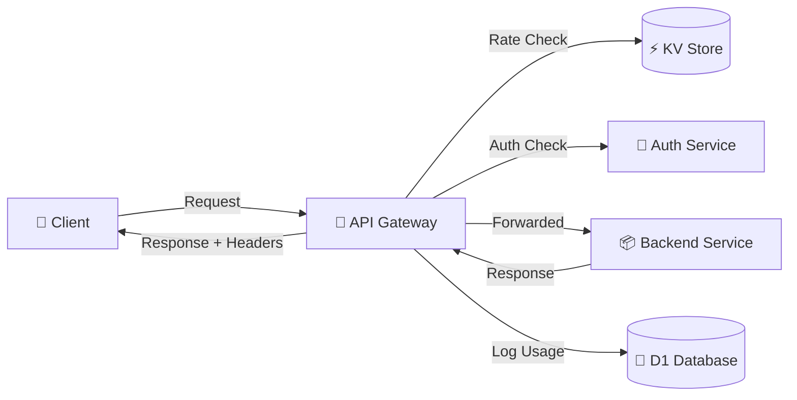
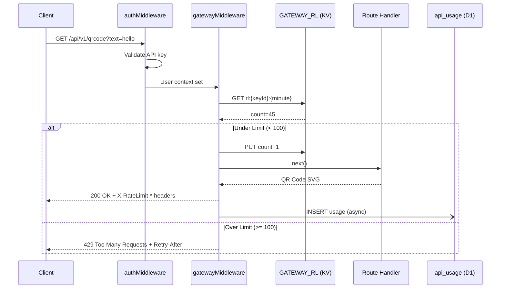

# 🚪 API Gateway: Rate Limiting & Usage Analytics

> **Master modern API Gateway patterns through real production code**

---

## Table of Contents
1. [What is an API Gateway?](#what-is-an-api-gateway)
2. [The Problem We're Solving](#the-problem-were-solving)
3. [Implementation Architecture](#implementation-architecture)
4. [Rate Limiting Deep Dive](#rate-limiting-deep-dive)
5. [Usage Analytics System](#usage-analytics-system)
6. [Code Walkthrough](#code-walkthrough)
7. [Testing Strategy](#testing-strategy)
8. [Interview Questions](#interview-questions)

---

## What is an API Gateway?

### The Concept

An API Gateway is a **reverse proxy** that sits between clients and your backend services. Think of it as a "bouncer + receptionist" for your APIs.



### The Four Pillars

| Pillar | Purpose | Example |
|--------|---------|---------|
| **Security** | Authentication, authorization | API key validation, JWT verification |
| **Control** | Rate limiting, quotas | 100 requests/minute per key |
| **Observability** | Logging, monitoring, analytics | Track requests/errors per service |
| **Transformation** | Request/response modification | Add headers, compress responses |

---

## The Problem We're Solving

### Before API Gateway

```typescript
// Every module handles its own concerns ❌
router.get('/products', async (c) => {
  // Auth (duplicated)
  const key = c.req.header('x-api-key')
  if (!isValid(key)) return c.json({ error: 'Unauthorized' }, 401)
  
  // Rate limiting (missing!)
  // Usage tracking (missing!)
  
  return c.json(await getProducts())
})
```

**Problems:**
- Code duplication across modules
- No centralized rate limiting
- No usage analytics
- Inconsistent error responses
- Hard to add new cross-cutting concerns

### After API Gateway

```typescript
// Gateway handles cross-cutting concerns ✅
app.use('/api/v1/*', authMiddleware)       // Security
app.use('/api/v1/*', gatewayMiddleware)   // Control + Observability

// Modules focus on business logic
router.get('/products', async (c) => {
  // Auth? ✅ Done by authMiddleware
  // Rate limit? ✅ Done by gatewayMiddleware
  // Usage tracking? ✅ Done by gatewayMiddleware
  return c.json(await getProducts())
})
```

---

## Implementation Architecture

### The "Start for Free" Approach

We implemented a **middleware-based gateway** that runs **in-process** with the Worker. This avoids:
- ❌ Additional network hop (latency)
- ❌ Separate infrastructure cost
- ❌ Complex service bindings

### Technology Choices

| Component | Technology | Why? | Free Tier? |
|-----------|-----------|------|------------|
| **Rate Limiting** | Cloudflare KV | Fast, eventual consistency OK | ✅ Yes |
| **Analytics** | D1 (SQLite) | Strong consistency, SQL queries | ✅ Yes |
| **Compute** | Same Worker | No extra cost/latency | ✅ Yes |

### Request Flow



---

## Rate Limiting Deep Dive

### Fixed Window Algorithm

We use the **Fixed Window** strategy: Count requests in discrete time buckets.

```
Minute 0: [*********] 9 requests  ✅ Allowed
Minute 1: [********************.....................] 50 requests ✅ Allowed
Minute 2: [**************************************************] 100 requests ❌ BLOCKED
Minute 3: [*] 1 request  ✅ Allowed (new window)
```

### Code: Rate Limit Check

**From `src/common/middleware/gateway.ts`**:

```typescript
async function checkRateLimit(
    kv: KVNamespace,
    apiKeyId: string,
    limit: number
): Promise<RateLimitResult> {
    const WINDOW_SECONDS = 60
    const currentWindow = Math.floor(Date.now() / 1000 / WINDOW_SECONDS)
    const key = `rl:${apiKeyId}:${currentWindow}`  // e.g. "rl:key123:28945740"
    
    // Get current count
    const currentCountStr = await kv.get(key)
    const currentCount = currentCountStr ? parseInt(currentCountStr, 10) : 0
    
    // Calculate reset time
    const resetTime = (currentWindow + 1) * WINDOW_SECONDS
    
    // Check limit
    if (currentCount >= limit) {
        return {
            allowed: false,
            limit,
            remaining: 0,
            resetTime,
        }
    }
    
    // Increment counter with TTL
    await kv.put(key, String(currentCount + 1), {
        expirationTtl: WINDOW_SECONDS + 5,  // 65s (small buffer for clock skew)
    })
    
    return {
        allowed: true,
        limit,
        remaining: limit - currentCount - 1,
        resetTime,
    }
}
```

### Response Headers

We follow the [IETF draft standard](https://datatracker.ietf.org/doc/html/draft-polli-ratelimit-headers):

```http
HTTP/1.1 200 OK
X-RateLimit-Limit: 100
X-RateLimit-Remaining: 54
X-RateLimit-Reset: 1738626420
```

When blocked:
```http
HTTP/1.1 429 Too Many Requests
X-RateLimit-Limit: 100
X-RateLimit-Remaining: 0
X-RateLimit-Reset: 1738626420
Retry-After: 45

{
  "error": "Rate Limit Exceeded",
  "message": "You have exceeded the rate limit of 100 requests per minute.",
  "retryAfter": 1738626420
}
```

---

## Usage Analytics System

### The Goal

Track every API request for:
1. **Billing**: Count requests per API key
2. **Analytics**: Popular services, peak times, error rates
3. **Security**: Detect abuse patterns

### Code: Usage Tracking

**From `src/common/middleware/gateway.ts`**:

```typescript
// After response is sent (non-blocking)
c.executionCtx.waitUntil(
    recordUsage(c.env.DB, {
        apiKeyId: user.id,
        service: extractServiceName(c.req.path),  // "qrcode"
        endpoint: c.req.path,                     // "/api/v1/qrcode"
        method: c.req.method,                     // "GET"
        statusCode: c.res.status,                 // 200
        latencyMs: Date.now() - startTime,        // 45ms
    })
)
```

**Key Insight**: `waitUntil()` allows async D1 writes **after** the response is sent to the client. This means:
- ✅ Zero latency impact on users
- ✅ Analytics failures don't block requests (fail-open)
- ❌ Can't guarantee delivery (if Worker crashes)

### Database Schema

```sql
CREATE TABLE api_usage (
    id TEXT PRIMARY KEY,
    api_key_id TEXT NOT NULL,
    service TEXT NOT NULL,        -- "qrcode", "shop", etc.
    endpoint TEXT NOT NULL,        -- Full path
    method TEXT NOT NULL,          -- "GET", "POST"
    status_code INTEGER NOT NULL,  -- 200, 404, 500
    latency_ms INTEGER NOT NULL,
    created_at TIMESTAMP DEFAULT CURRENT_TIMESTAMP,
    FOREIGN KEY (api_key_id) REFERENCES api_keys(id)
);

CREATE INDEX idx_api_usage_key ON api_usage(api_key_id);
CREATE INDEX idx_api_usage_time ON api_usage(created_at);
```

### Analytics Queries

**Total requests per service (last 7 days):**
```sql
SELECT 
    service,
    COUNT(*) as total_requests,
    AVG(latency_ms) as avg_latency
FROM api_usage
WHERE created_at >= datetime('now', '-7 days')
GROUP BY service
ORDER BY total_requests DESC;
```

**Error rate by API key:**
```sql
SELECT 
    api_key_id,
    COUNT(*) as total,
    SUM(CASE WHEN status_code >= 400 THEN 1 ELSE 0 END) as errors,
    ROUND(100.0 * SUM(CASE WHEN status_code >= 400 THEN 1 ELSE 0 END) / COUNT(*), 2) as error_rate
FROM api_usage
WHERE created_at >= datetime('now', '-1 day')
GROUP BY api_key_id
HAVING error_rate > 5.0
ORDER BY error_rate DESC;
```

---

## Code Walkthrough

### File: `src/common/middleware/gateway.ts`

**Structure:**
```
├── Configuration (RATE_LIMIT_CONFIG)
├── Types (RateLimitResult)
├── Rate Limiting Logic
│   ├── getRateLimitKey()
│   └── checkRateLimit()
├── Usage Tracking Logic
│   ├── recordUsage()
│   └── extractServiceName()
└── Main Middleware
    └── gatewayMiddleware()
```

**Middleware Flow:**
```typescript
export const gatewayMiddleware = async (c, next) => {
    // 1. Record start time
    const startTime = Date.now()
    c.set('startTime', startTime)
    
    // 2. Get user (set by authMiddleware)
    const user = c.get('user')
    if (!user) {
        await next()
        return
    }
    
    // 3. Check rate limit
    const rateLimitResult = await checkRateLimit(...)
    
    // 4. Set headers (always)
    c.header('X-RateLimit-Limit', String(rateLimitResult.limit))
    c.header('X-RateLimit-Remaining', String(rateLimitResult.remaining))
    c.header('X-RateLimit-Reset', String(rateLimitResult.resetTime))
    
    // 5. Block if exceeded
    if (!rateLimitResult.allowed) {
        return c.json({ error: 'Rate Limit Exceeded' }, 429)
    }
    
    // 6. Proceed to handler
    await next()
    
    // 7. Track usage (async, after response)
    c.executionCtx.waitUntil(recordUsage(...))
}
```

---

## Testing Strategy

### Unit Tests (`test/modules/gateway.test.ts`)

We test the **logic** without Hono/HTTP:

```typescript
describe('Rate Limiting Logic', () => {
    it('should allow first request (counter = 0)', async () => {
        const mockKV = createMockKV()
        const result = await checkRateLimit(mockKV, 'test-key', 100)
        
        expect(result.allowed).toBe(true)
        expect(result.remaining).toBe(99)
    })
    
    it('should block when limit is reached', async () => {
        const mockKV = createMockKV({ 'rl:test-key:123': '100' })
        const result = await checkRateLimit(mockKV, 'test-key', 100)
        
        expect(result.allowed).toBe(false)
        expect(result.remaining).toBe(0)
    })
})
```

**Test Coverage:**
- ✅ Counter increments correctly
- ✅ Blocking at limit
- ✅ Reset time calculation
- ✅ TTL storage
- ✅ Unique keys per API key
- ✅ D1 insert validation

---

## Interview Questions

### Q1: Design a rate limiter for a distributed system.

**Answer Framework:**
1. **Requirements Clarification**
   - "Should it be per-user or per-IP?"
   - "What's the time window?"
   - "How many users?"
   
2. **Algorithm Choice**
   - Fixed Window (simple, this project)
   - Sliding Window (accurate)
   - Token Bucket (smooth)
   - Leaky Bucket (queue-based)
   
3. **Storage**
   - Redis/KV for counters
   - Atomic increments
   - TTL for auto-cleanup
   
4. **Headers**
   - `X-RateLimit-*` standard
   - `Retry-After` on 429

**Talk about this implementation**: \"In UtilNest, I used Fixed Window with Cloudflare KV. The key is `rl:{apiKeyId}:{minute}` with a 65-second TTL. It's eventually consistent, which is fine for rate limiting.\"

### Q2: How do you handle spikes in traffic?

**Answer:**
1. **Edge Caching**: Serve static responses from cache
2. **Graceful Degradation**: Return cached data if DB is slow
3. **Circuit Breakers**: Stop querying failing services
4. **Auto-scaling**: Workers scale automatically
5. **Rate Limiting**: Protect backend from abuse

**This Project**: \"We use KV for rate limits (ultra-fast) and `waitUntil()` for analytics (doesn't block). The Gateway itself is stateless and scales with Workers.\"

### Q3: Explain \"Fail-Open\" vs \"Fail-Closed\"

**Answer:**
- **Fail-Closed**: If something breaks, block the request (security-first)
- **Fail-Open**: If something breaks, allow the request (availability-first)

**This Project**:
- **Rate Limiting**: Fail-Closed (if KV errors, we could block to be safe)
- **Analytics**: Fail-Open (if D1 fails, we still return the response)

```typescript
try {
    await recordUsage(...)  // Analytics
} catch (error) {
    console.error('[Gateway] Usage tracking error:', error)
    // Don't fail the request!
}
```

---

## Next: Enterprise Features (Phase 2)

- [ ] Tiered Rate Limits (Free/Pro/Enterprise)
- [ ] Sliding Window Algorithm
- [ ] Monthly Quotas (D1 counter)
- [ ] Admin Dashboard (Analytics UI)
- [ ] Webhooks (Usage alerts)
- [ ] Durable Objects (Global rate limiting)

---

**Resources:**
- Code: [`src/common/middleware/gateway.ts`](../../src/common/middleware/gateway.ts)
- Tests: [`test/modules/gateway.test.ts`](../../test/modules/gateway.test.ts)
- Schema: [`schema.sql`](../../schema.sql) (api_usage table)
