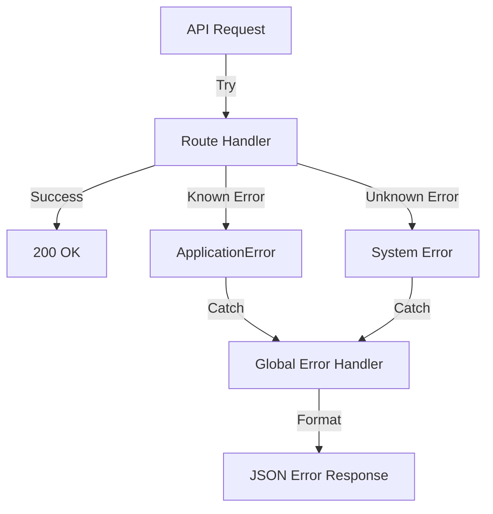

# 🏭 Production Best Practices

> **Building reliable, observable, and maintainable serverless APIs**

---

## Table of Contents
1. [Error Handling Strategies](#error-handling-strategies)
2. [Logging & Observability](#logging--observability)
3. [Security Hardening](#security-hardening)
4. [Performance Optimization](#performance-optimization)
5. [Reliability Patterns](#reliability-patterns)
6. [Deployment & Operations](#deployment--operations)

---

## Error Handling Strategies

### The Error Hierarchy



### 1. Application Errors (Expected)

These are **business logic** errors (user not found, invalid API key, etc.).

**Pattern:**
```typescript
/ src/common/errors.ts
export class ApiError extends Error {
    constructor(
        public statusCode: number,
        message: string,
        public code?: string
    ) {
        super(message)
        this.name = 'ApiError'
    }
}

// Usage in code
if (!user) {
    throw new ApiError(404, 'User not found', 'USER_NOT_FOUND')
}
```

**Global Handler:**
```typescript
// src/common/errors.ts
export function handleError(err: Error, c: Context) {
    if (err instanceof ApiError) {
        return c.json({
            error: err.message,
            code: err.code,
        }, err.statusCode)
    }
    
    // Unknown error - don't leak details!
    console.error('[UNHANDLED]', err)
    return c.json({
        error: 'Internal Server Error',
    }, 500)
}

// Apply globally
app.onError((err, c) => handleError(err, c))
```

### 2. Validation Errors

**Best Practice:** Validate early, fail fast.

```typescript
import { z } from 'zod'

const CreateProductSchema = z.object({
    name: z.string().min(1).max(100),
    price: z.number().positive(),
    category: z.enum(['electronics', 'clothing', 'food']),
})

router.post('/products', async (c) => {
    const body = await c.req.json()
    
    // Validate (throws ZodError if invalid)
    const product = CreateProductSchema.parse(body)
    
    // Now 'product' is type-safe!
    return c.json({ success: true })
})
```

**Handle ZodError:**
```typescript
app.onError((err, c) => {
    if (err instanceof z.ZodError) {
        return c.json({
            error: 'Validation failed',
            issues: err.errors.map(e => ({
                path: e.path.join('.'),
                message: e.message,
            })),
        }, 400)
    }
    // ... rest of error handling
})
```

### 3. Database Errors

**Pattern: Wrap DB errors with context**

```typescript
try {
    const result = await db.prepare('SELECT * FROM users WHERE id = ?')
        .bind(userId)
        .first()
} catch (error) {
    console.error('[DB Error]', {
        query: 'SELECT users',
        userId,
        error: error.message,
    })
    throw new ApiError(500, 'Database error', 'DB_ERROR')
}
```

---

## Logging & Observability

### Logging Levels

| Level | When to Use | Example |
|-------|-------------|---------|
| `DEBUG` | Development only | Variable values, flow trace |
| `INFO` | Request lifecycle | "Request started", "Cache hit" |
| `WARN` | Recoverable issues | "DB slow (>100ms)", "Cache miss" |
| `ERROR` | Failures | "DB connection failed", "Auth error" |

### Structured Logging

**Bad (unstructured):**
```typescript
console.log('User login failed for user@example.com')
```

**Good (structured):**
```typescript
console.log(JSON.stringify({
    level: 'WARN',
    event: 'login_failed',
    email: 'user@example.com',
    ip: c.req.header('cf-connecting-ip'),
    timestamp: new Date().toISOString(),
}))
```

**Why?** Structured logs are **queryable** in tools like Grafana, Datadog.

### Request Tracing

**Pattern: Add request ID**

```typescript
app.use('*', async (c, next) => {
    const requestId = crypto.randomUUID()
    c.set('requestId', requestId)
    c.header('X-Request-ID', requestId)
    
    console.log('[REQUEST]', {
        requestId,
        method: c.req.method,
        path: c.req.path,
    })
    
    await next()
    
    console.log('[RESPONSE]', {
        requestId,
        status: c.res.status,
    })
})
```

**Usage in errors:**
```typescript
throw new ApiError(500, `Database error (request: ${c.get('requestId')})`)
```

### Metrics to Track

**RED Method** (Request-centric):
- **Rate**: Requests per second
- **Errors**: Error rate (%)
- **Duration**: P50, P95, P99 latency

**USE Method** (Resource-centric):
- **Utilization**: CPU time used
- **Saturation**: KV write queue length
- **Errors**: Rate limit hits, DB errors

**Example: Track in D1**
```sql
-- Daily summary
SELECT 
    DATE(created_at) as date,
    COUNT(*) as total_requests,
    AVG(latency_ms) as avg_latency,
    SUM(CASE WHEN status_code >= 400 THEN 1 ELSE 0 END) as errors
FROM api_usage
GROUP BY DATE(created_at)
ORDER BY date DESC
LIMIT 30;
```

---

## Security Hardening

### 1. Input Validation

**Always validate untrusted input:**

```typescript
// ❌ BAD: SQL Injection risk
const result = await db.prepare(`SELECT * FROM users WHERE email = '${email}'`).all()

// ✅ GOOD: Parameterized query
const result = await db.prepare('SELECT * FROM users WHERE email = ?')
    .bind(email)
    .all()
```

### 2. Rate Limiting (Covered in ADR-005)

**Prevent abuse:**
- 100 requests/minute per API key
- 1000 requests/hour per IP (future)

### 3. CORS Configuration

**Restrict origins:**

```typescript
import { cors } from 'hono/cors'

app.use('/api/*', cors({
    origin: ['https://utilnest.com', 'https://app.utilnest.com'],
    allowMethods: ['GET', 'POST', 'PUT', 'DELETE'],
    allowHeaders: ['Content-Type', 'x-api-key'],
    maxAge: 86400,  // 24 hours
}))
```

### 4. Secrets Management

**Never commit secrets!**

**.dev.vars (local):**
```
KINDE_CLIENT_SECRET=abc123
DATABASE_URL=...
```

**Production (Cloudflare):**
```bash
npx wrangler secret put KINDE_CLIENT_SECRET
# Paste value when prompted
```

**Access in code:**
```typescript
const secret = c.env.KINDE_CLIENT_SECRET  // From bindings
```

### 5. Content Security Policy

**Prevent XSS:**

```typescript
app.use('*', async (c, next) => {
    await next()
    c.header('Content-Security-Policy', "default-src 'self'; script-src 'self' 'unsafe-inline'")
    c.header('X-Frame-Options', 'DENY')
    c.header('X-Content-Type-Options', 'nosniff')
})
```

---

## Performance Optimization

### 1. Caching Strategy

**Cache Layers:**
```
Client → Cloudflare CDN (60s) → Worker → KV (1hr) → D1/Origin
```

**Example: Link Preview**
```typescript
// Try cache first
const cacheKey = `preview:${url}`
const cached = await kv.get(cacheKey)
if (cached) {
    c.header('X-Cache', 'HIT')
    return c.json(JSON.parse(cached))
}

// Fetch from origin
const metadata = await fetchMetadata(url)

// Cache for 1 hour
await kv.put(cacheKey, JSON.stringify(metadata), {
    expirationTtl: 3600,
})

c.header('X-Cache', 'MISS')
return c.json(metadata)
```

### 2. Database Indexing

**Slow query:**
```sql
-- Without index: O(n) scan
SELECT * FROM api_keys WHERE prefix = 'sk_live_abc1'
```

**Fast query:**
```sql
-- With index: O(log n) lookup
CREATE INDEX idx_api_keys_prefix ON api_keys(prefix);
SELECT * FROM api_keys WHERE prefix = 'sk_live_abc1'
```

**Rule of Thumb:** Index any column used in `WHERE` clauses.

### 3. Async Operations

**Pattern: Use `waitUntil()` for non-critical work**

```typescript
// ❌ BAD: Blocks response (50ms added)
await logToAnalytics(...)
return c.json({ success: true })

// ✅ GOOD: Returns immediately, logs in background
c.executionCtx.waitUntil(logToAnalytics(...))
return c.json({ success: true })
```

**Use Cases:**
- Analytics logging
- Cache warming
- Webhook triggers
- Email sending (if not critical to UX)

### 4. Bundle Size Optimization

**Check bundle:**
```bash
npx wrangler deploy --dry-run --outdir=dist
ls -lh dist/_worker.js  # Should be < 1MB
```

**Reduce size:**
- Avoid heavy dependencies (moment.js → date-fns)
- Use tree-shaking (import only what you need)
- Code-split (future: separate Workers per service)

---

## Reliability Patterns

### 1. Circuit Breaker

**Pattern: Stop calling a failing service**

```typescript
let dbErrorCount = 0
const CIRCUIT_BREAKER_THRESHOLD = 5

async function queryDB(query: string) {
    if (dbErrorCount >= CIRCUIT_BREAKER_THRESHOLD) {
        throw new ApiError(503, 'Database unavailable', 'CIRCUIT_OPEN')
    }
    
    try {
        const result = await db.prepare(query).all()
        dbErrorCount = 0  // Reset on success
        return result
    } catch (error) {
        dbErrorCount++
        throw error
    }
}
```

### 2. Graceful Degradation

**Pattern: Return cached/stale data if fresh data unavailable**

```typescript
try {
    const fresh = await fetchFromAPI()
    await kv.put('last-known-good', JSON.stringify(fresh))
    return fresh
} catch (error) {
    console.warn('[Degraded] Returning cached data')
    const cached = await kv.get('last-known-good')
    if (cached) return JSON.parse(cached)
    throw error  // No fallback available
}
```

### 3. Retry with Exponential Backoff

**Pattern: Retry transient failures**

```typescript
async function fetchWithRetry(url: string, maxRetries = 3) {
    for (let i = 0; i < maxRetries; i++) {
        try {
            return await fetch(url)
        } catch (error) {
            if (i === maxRetries - 1) throw error  // Last attempt
            
            const delay = Math.pow(2, i) * 1000  // 1s, 2s, 4s
            await new Promise(resolve => setTimeout(resolve, delay))
        }
    }
}
```

### 4. Health Checks

**Simple health endpoint:**

```typescript
router.get('/health', async (c) => {
    const checks = []
    
    // Check D1
    try {
        await c.env.DB.prepare('SELECT 1').first()
        checks.push({ component: 'database', status: 'healthy' })
    } catch (error) {
        checks.push({ component: 'database', status: 'unhealthy' })
    }
    
    // Check KV
    try {
        await c.env.PREVIEW_CACHE.get('health-check')
        checks.push({ component: 'cache', status: 'healthy' })
    } catch (error) {
        checks.push({ component: 'cache', status: 'unhealthy' })
    }
    
    const allHealthy = checks.every(c => c.status === 'healthy')
    
    return c.json({
        status: allHealthy ? 'ok' : 'degraded',
        checks,
    }, allHealthy ? 200 : 503)
})
```

---

## Deployment & Operations

### 1. Environment Strategy

| Environment | Purpose | Database | Secrets |
|-------------|---------|----------|---------|
| **Local** | Development | SQLite file | .dev.vars |
| **Staging** | Testing | D1 (separate DB) | Cloudflare secrets |
| **Production** | Live traffic | D1 (prod DB) | Cloudflare secrets |

**Deploy to staging:**
```bash
npx wrangler deploy --env staging
```

### 2. Database Migrations

**Pattern: Version your schema changes**

**`migrations/001_create_users.sql`:**
```sql
CREATE TABLE users (
    id TEXT PRIMARY KEY,
    email TEXT UNIQUE NOT NULL,
    created_at TIMESTAMP DEFAULT CURRENT_TIMESTAMP
);
```

**`migrations/002_add_is_active.sql`:**
```sql
ALTER TABLE users ADD COLUMN is_active BOOLEAN DEFAULT 1;
```

**Apply:**
```bash
npx wrangler d1 execute api-platform-db --remote --file=migrations/002_add_is_active.sql
```

### 3. Rollback Strategy

**Zero-downtime deployments:**

1. **Deploy new version** (blue-green)
2. **Monitor errors** (5 min)
3. **If errors spike → Rollback:**
   ```bash
   npx wrangler rollback --message "Reverting due to 500 errors"
   ```

**Canary deployments (future):**
- Route 10% traffic to new version
- Monitor metrics
- Gradually increase to 100%

### 4. Monitoring & Alerts

**Cloudflare Analytics:**
- Request volume (requests/sec)
- Error rate (%)
- P99 latency

**Custom metrics (D1):**
```sql
-- Alert if error rate > 5%
SELECT 
    COUNT(*) as total,
    SUM(CASE WHEN status_code >= 500 THEN 1 ELSE 0 END) as errors,
    100.0 * SUM(CASE WHEN status_code >= 500 THEN 1 ELSE 0 END) / COUNT(*) as error_rate
FROM api_usage
WHERE created_at >= datetime('now', '-5 minutes')
HAVING error_rate > 5;
```

---

## Checklist: Production Readiness

### Before Deploying
- [ ] All secrets in Cloudflare (not `.dev.vars`)
- [ ] Error handling covers all endpoints
- [ ] Rate limiting enabled
- [ ] CORS configured for production origins
- [ ] Database indexes added for common queries
- [ ] Health check endpoint working
- [ ] Logging includes request IDs
- [ ] Bundle size < 1MB

### After Deploying
- [ ] Monitor error rate (first 30 min)
- [ ] Check P99 latency
- [ ] Verify rate limiting works
- [ ] Test rollback procedure
- [ ] Document any gotchas for next deploy

---

**Resources:**
- [Cloudflare Workers Docs](https://developers.cloudflare.com/workers/)
- [The Twelve-Factor App](https://12factor.net/)
- [Google SRE Book](https://sre.google/sre-book/table-of-contents/)
