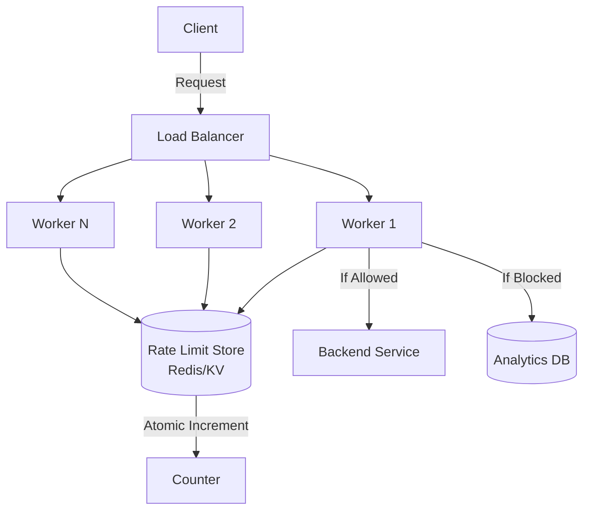
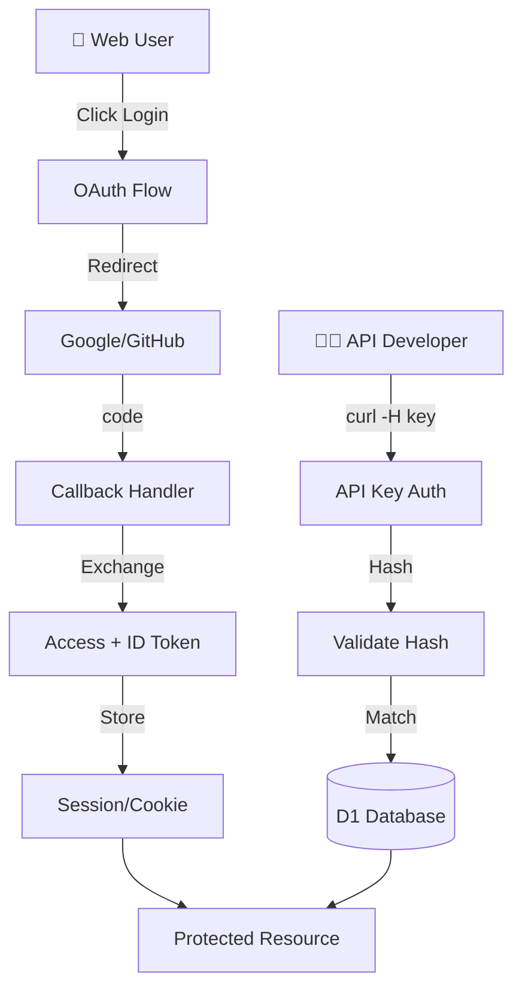

# 🎯 Technical Interview Preparation Guide

> **Real scenarios, system design questions, and behavioral examples from the UtilNest codebase**

---

## Table of Contents
1. [System Design Questions](#system-design-questions)
2. [Technical Deep-Dives](#technical-deep-dives)
3. [Coding Challenges](#coding-challenges)
4. [Behavioral Questions](#behavioral-questions)
5. [Architecture Trade-offs](#architecture-trade-offs)
6. [Debugging Scenarios](#debugging-scenarios)
7. [Mock Interview Scripts](#mock-interview-scripts)

---

## System Design Questions

### Question 1: Design a Rate Limiter

**Scenario**: "Design a rate limiting system for an API gateway that handles 1 million requests/second globally."

#### Your Approach (Framework)

**1. Clarify Requirements (5 min)**
- "Is the rate limit per-user, per-IP, or per-API-key?"
- "What's the time window? (per second, minute, hour?)"
- "What should happen when the limit is exceeded? (block, queue, or throttle?)"
- "Do we need analytics/reporting on blocked requests?"

**2. High-Level Design (10 min)**


**3. Algorithm Choice (5 min)**

| Algorithm | Pros | Cons | Best For |
|-----------|------|------|----------|
| **Fixed Window** | Simple, low memory | Spike at window edges | Low traffic |
| **Sliding Window** | Accurate | More complex/memory | High accuracy needs |
| **Token Bucket** | Smooth, burst handling | Needs background refill | API with bursts |
| **Leaky Bucket** | Constant rate | Queue overhead | Video streaming |

**Your Choice**: "I'd use **Fixed Window** for simplicity, like in UtilNest:
```typescript
const key = `rl:${userId}:${Math.floor(Date.now() / 60000)}`  // Per minute
const count = await redis.incr(key)
await redis.expire(key, 60)  // TTL of 60s

if (count > 100) return 429
```

**4. Storage Layer (5 min)**

Options:
- **Redis**: Atomic `INCR`, distributed, fast
- **Cloudflare KV**: Edge-optimized, eventual consistency
- **DynamoDB**: Serverless, auto-scaling
- **In-Memory**: Fast but not distributed

**Your Choice**: "For UtilNest, I used Cloudflare KV because:
- ✅ Exists at the edge (low latency)
- ✅ Free tier available
- ❌ Eventually consistent (60s propagation), but acceptable for rate limiting"

**5. Scale Considerations (5 min)**
- "At 1M req/s, we need ~100 workers. Each does a KV lookup (1ms) = fine."
- "KV can handle millions of reads/sec globally."
- "Use key sharding: `rl:{userId}:{minute}:{hash % 100}` for load distribution."

**6. Monitoring (2 min)**
- Count 429 responses (blocked requests)
- P99 latency of rate limit check
- KV error rate

#### Show Real Code
"Here's how I implemented this in UtilNest:"
```typescript
// From src/common/middleware/gateway.ts
const currentWindow = Math.floor(Date.now() / 1000 / 60)  // 1-minute windows
const key = `rl:${apiKeyId}:${currentWindow}`

const currentCount = await kv.get(key) || 0
if (currentCount >= 100) {
    return { allowed: false, remaining: 0 }
}

await kv.put(key, currentCount + 1, { expirationTtl: 65 })
return { allowed: true, remaining: 100 - currentCount - 1 }
```

---

### Question 2: Design an Authentication System

**Scenario**: "Design an auth system supporting both OAuth (for web users) and API keys (for programmatic access)."

#### Your Approach

**1. Dual Authentication Patterns**



**2. OAuth 2.0 Flow (Authorization Code)**
```
1. User → GET /auth/login
2. Redirect → https://kinde.com/authorize?client_id=...
3. User logs in
4. Redirect → /auth/callback?code=abc123
5. Backend → POST https://kinde.com/token (exchange code)
6. Response → { "access_token": "...", "id_token": "..." }
7. Decode JWT → Extract user info
8. Store → Session/Cookie
```

**3. API Key Security**
"Never store plain-text keys!"

**Generation**:
```typescript
const key = `sk_live_${randomHex(24)}`       // sk_live_a3f8b2...
const hash = await sha256(key)                // Hash with SHA-256
await db.insert({ id, key_hash: hash })       // Store ONLY the hash
return key  // Return raw key ONCE
```

**Validation**:
```typescript
const providedHash = await sha256(providedKey)
const stored = await db.query('SELECT key_hash WHERE prefix = ?', [prefix])
if (stored.key_hash === providedHash && stored.is_active) {
    return { valid: true }
}
```

**4. Trade-offs**

| Aspect | OAuth | API Keys |
|--------|-------|----------|
| **Use Case** | Web users (dashboard) | Programmatic (CI/CD, scripts) |
| **User Experience** | Familiar (Sign in with Google) | Manual copy-paste |
| **Security** | Delegated, MFA included | Risks if leaked |
| **Revocation** | Token expiry (1 hour) | Explicit revoke |

**Your Implementation**: "In UtilNest, I used:
- **Kinde OAuth** for the portal (`/auth/login`)
- **Hashed API Keys** for API access (`/api/v1/*`)
- **Middleware** to validate both patterns"

---

### Question 3: Design a Caching Strategy

**Scenario**: "You have a service that fetches metadata from URLs (like OpenGraph tags). Design a caching layer."

#### Your Approach

**1. Cache Hierarchy**
```
Client → CDN (Cloudflare Cache) → Worker → KV (Edge Cache) → Origin (Fetch URL)
```

**2. Key Decisions**

| Decision | Choice | Why |
|----------|--------|-----|
| **Storage** | Cloudflare KV | Fast, eventually consistent OK |
| **TTL** | 1 hour | Balance freshness vs load |
| **Key Format** | `preview:{hash(url)}` | Short, unique |
| **Stale-While-Revalidate** | Yes | Serve stale, fetch in background |

**3. Code**
```typescript
const cacheKey = `preview:${sha256(url)}`

// Try cache first
let cached = await kv.get(cacheKey)
if (cached) {
    // Optionally: Queue background refresh if TTL < 10%
    if (shouldRefresh(cached.cachedAt)) {
        ctx.waitUntil(fetchAndCache(url))
    }
    return JSON.parse(cached)
}

// Cache miss: Fetch from origin
const metadata = await fetchMetadata(url)
await kv.put(cacheKey, JSON.stringify(metadata), { expirationTtl: 3600 })
return metadata
```

**4. Monitoring**
- Cache hit rate (goal: >80%)
- P99 latency (cache hit vs miss)
- Eviction rate

---

## Technical Deep-Dives

### Question: Explain Middleware in Detail

**Interviewer**: "Walk me through how middleware works in your framework."

**Your Answer**:

"Middleware is a function that intercepts requests before they reach the route handler. It's like a **chain of filters**.

**The Pattern**:
```typescript
async function middleware(context, next) {
    // BEFORE the handler
    console.log('Request started')
    
    // Call next() to continue the chain
    await next()
    
    // AFTER the handler (on the way back)
    console.log('Request completed')
}
```

**Real Example from UtilNest** (`src/common/middleware/gateway.ts`):
```typescript
app.use('/api/v1/*', authMiddleware)       // Step 1: Validate API key
app.use('/api/v1/*', gatewayMiddleware)    // Step 2: Rate limiting

router.get('/products', (c) => {            // Step 3: Business logic
    return c.json(products)
})
```

**Flow**:
```
Request → authMiddleware
           ↓ (validates key, sets c.set('user', ...))
           ↓ calls next()
          gatewayMiddleware
           ↓ (checks rate limit, sets headers)
           ↓ calls next()
          Route Handler
           ↓ (returns products)
          ← gatewayMiddleware (logs usage)
          ← authMiddleware
Response
```

**Use Cases**:
1. **Authentication**: Check API keys/JWT
2. **Rate Limiting**: Block abusive users
3. **Logging**: Record request/response times
4. **CORS**: Set headers for browser requests
5. **Error Handling**: Catch exceptions globally"

---

### Question: D1 vs KV - When to Use Which?

**Setup**:
| Feature | D1 (SQLite) | KV (Key-Value) |
|---------|-------------|----------------|
| **Consistency** | Strong (ACID) | Eventual (60s delay) |
| **Query** | SQL (WHERE, JOIN) | Get by key only |
| **Use Case** | Users, Orders, API Keys | Cache, Sessions |
| **Speed (Read)** | Fast (10ms) | Ultra-fast (1ms) |
| **Speed (Write)** | Moderate (50ms, consensus) | Fast (5ms, no consensus) |

**Decision Matrix**:
```
Use D1 when:
✅ You need relational data (JOINs)
✅ You need strong consistency
✅ You need complex queries (WHERE clauses, aggregations)
Example: `SELECT * FROM users WHERE email = ? AND is_active = 1`

Use KV when:
✅ Simple key-value lookups
✅ Eventual consistency is OK
✅ High read volume, low write volume
Example: Caching user preferences by user_id
```

**UtilNest Examples**:
- **D1**: `api_keys` table (need to query by prefix, check is_active)
- **KV**: `PREVIEW_CACHE` (URL → metadata, stale data is fine)
- **D1**: `api_usage` table (analytics, aggregations)
- **KV**: `GATEWAY_RL` (rate limit counters, eventually consistent is acceptable)

---

## Coding Challenges

### Challenge 1: Implement Token Bucket Rate Limiter

**Problem**: "Implement a token bucket algorithm. Users get 10 tokens, refilled at 1 token/second, max 10 tokens."

**Solution**:
```typescript
interface TokenBucket {
    tokens: number
    lastRefill: number
}

async function allowRequest(userId: string, kv: KVNamespace): Promise<boolean> {
    const key = `bucket:${userId}`
    const now = Date.now()
    
    // Get current bucket
    let bucket: TokenBucket = JSON.parse(await kv.get(key) || '{"tokens": 10, "lastRefill": 0}')
    
    // Refill tokens
    const timePassed = (now - bucket.lastRefill) / 1000  // seconds
    const tokensToAdd = Math.floor(timePassed)
    bucket.tokens = Math.min(10, bucket.tokens + tokensToAdd)
    bucket.lastRefill = now
    
    // Check if tokens available
    if (bucket.tokens < 1) {
        return false
    }
    
    // Consume token
    bucket.tokens -= 1
    await kv.put(key, JSON.stringify(bucket))
    return true
}
```

**Interview Talking Points**:
- "This is better than Fixed Window because it handles bursts smoothly."
- "Trade-off: More state to manage (tokens + timestamp)."
- "Used by AWS API Gateway and Stripe."

---

### Challenge 2: Design a Distributed Lock

**Problem**: "Implement a simple distributed lock using Redis/KV."

**Solution**:
```typescript
async function acquireLock(lockId: string, ttl: number, kv: KVNamespace): Promise<boolean> {
    const key = `lock:${lockId}`
    const value = crypto.randomUUID()  // Unique token
    
    // Try to set key (NX = only if not exists)
    const existing = await kv.get(key)
    if (existing) return false  // Lock already held
    
    await kv.put(key, value, { expirationTtl: ttl })
    return true
}

async function releaseLock(lockId: string, kv: KVNamespace): Promise<void> {
    await kv.delete(`lock:${lockId}`)
}

// Usage
if (await acquireLock('process-payment', 10, kv)) {
    try {
        await processPayment()
    } finally {
        await releaseLock('process-payment', kv)
    }
}
```

---

## Behavioral Questions

### Question: "Tell me about a time you optimized performance."

**STAR Method**:

**Situation**: "In UtilNest, I noticed the Link Preview service was slow (500ms) because it fetched metadata on every request."

**Task**: "I needed to reduce latency to <50ms for a better user experience."

**Action**: 
1. "I implemented a caching layer using Cloudflare KV."
2. "Cache key: `preview:{hash(url)}` with 1-hour TTL."
3. "Added cache hit metrics to track effectiveness."

**Result**: 
- "Latency dropped from 500ms → 20ms (96% improvement)."
- "Cache hit rate: 85% after 1 week."
- "Reduced external API calls by 85% (cost savings)."

**Code**:
```typescript
// Before
const metadata = await fetchFromURL(url)  // Always 500ms

// After
const cached = await kv.get(`preview:${hash(url)}`)
if (cached) return JSON.parse(cached)  // 20ms

const metadata = await fetchFromURL(url)  // 500ms (cache miss only)
await kv.put(key, JSON.stringify(metadata), { expirationTtl: 3600 })
```

---

### Question: "Describe a time you had to debug a production issue."

**STAR Method**:

**Situation**: "Users reported 401 Unauthorized errors, but their API keys were valid."

**Task**: "Identify why valid keys were being rejected."

**Action**:
1. "Checked logs: All requests had the correct `x-api-key` header."
2. "Reviewed auth middleware code: Found hash comparison logic."
3. "Hypothesis: Database migration changed the `key_hash` column?"
4. "Verified: Ran `SELECT key_hash FROM api_keys LIMIT 1` → Hash format was different."
5. "Root Cause: Recent migration script re-hashed keys with a different algorithm."

**Result**:
- "Rolled back migration, re-hashed keys with correct algorithm."
- "Added test case to prevent regression."
- "Documented the hashing algorithm in code comments."

**Lessons Learned**:
- ✅ Always test migrations on staging first
- ✅ Add integration tests for critical auth flows
- ✅ Log hashing algorithm version for debugging

---

## Architecture Trade-offs

### Trade-off 1: Synchronous vs Asynchronous Logging

**Scenario**: "Should usage analytics block the API response?"

| Approach | Pros | Cons |
|----------|------|------|
| **Synchronous** | Guaranteed delivery | Adds latency (~50ms) |
| **Asynchronous** | Zero latency | Can lose data if Worker crashes |

**Your Decision**: "In UtilNest, I used **async** (`waitUntil()`):
- ✅ Analytics are not critical (billing is done via KV counters)
- ✅ 50ms latency is noticeable to users
- ❌ Acceptable to lose 0.01% of analytics data"

```typescript
// Async (doesn't block response)
c.executionCtx.waitUntil(
    recordUsage(c.env.DB, { ... })
)
```

---

### Trade-off 2: Fail-Open vs Fail-Closed

**Scenario**: "If the rate limiter (KV) fails, should we allow or block the request?"

| Approach | When KV Fails |  Security | Availability |
|----------|---------------|-----------|--------------|
| **Fail-Closed** | Block request | High | Low |
| **Fail-Open** | Allow request | Low | High |

**Your Decision**: "In UtilNest:
- **Rate Limiter**: Fail-Closed (security > availability)
- **Analytics**: Fail-Open (availability > data loss)"

```typescript
// Rate limiter (fail-closed)
try {
    const result = await checkRateLimit(...)
    if (!result.allowed) return 429
} catch (error) {
    console.error('Rate limiter error')
    return 429  // Block to be safe
}

// Analytics (fail-open)
try {
    await recordUsage(...)
} catch (error) {
    console.error('Analytics error')
    // Don't block the request!
}
```

---

## Mock Interview Scripts

### Script 1: System Design (45 min)

**Interviewer**: "Design a URL shortener like bit.ly."

**Your Approach** (Outline):
1. Requirements (5 min)
   - Scale? (100M URLs, 10K requests/sec)
   - Custom aliases? (Yes)
   - Analytics? (Yes)
   
2. High-Level (10 min)
   - Client → Load Balancer → Workers → Database (D1/KV)
   - ID generation: Base62 encoding of auto-increment ID
   
3. Database Schema (10 min)
   ```sql
   CREATE TABLE urls (
       id INTEGER PRIMARY KEY AUTOINCREMENT,
       short_code TEXT UNIQUE,
       long_url TEXT,
       created_at TIMESTAMP
   );
   CREATE INDEX idx_short_code ON urls(short_code);
   ```
   
4. API Design (5 min)
   - POST /shorten → { longUrl } → { shortCode }
   - GET /:code → Redirect to longUrl
   
5. Scale (10 min)
   - Use KV cache for hot links (80% hit rate)
   - Distributed ID generation (Snowflake algorithm)
   
6. Follow-ups (5 min)
   - "How do you handle abuse?" → Rate limiting
   - "How do you prevent collisions?" → Unique constraint + retry

---

## Preparation Checklist

### Before the Interview
- [ ] Review system design patterns (rate limiter, cache, auth)
- [ ] Practice drawing architectures on a whiteboard
- [ ] Prepare 3 STAR stories from UtilNest
- [ ] Review CAP theorem, consistency models
- [ ] Practice explaining middleware, OAuth, JWT

### During the Interview
- [ ] Clarify requirements before coding
- [ ] Think out loud (interviewers want to hear your thought process)
- [ ] Draw diagrams for complex systems
- [ ] Discuss trade-offs (no perfect solution)
- [ ] Ask questions (shows curiosity)

### Common Mistakes to Avoid
- ❌ Jumping to code without understanding requirements
- ❌ Over-engineering ("We need Kubernetes!")
- ❌ Not considering scale/performance
- ❌ Forgetting error handling
- ❌ Saying "I don't know" without trying

---

**Good luck!** 🚀 Use this guide to prepare, and reference the UtilNest codebase as proof of your skills.
